#  DIGREPORT

**Autor:** Marcos Francisco Varela Marcos  
**Versión README: **1.0

---

## 📝 Descripción

DIGREPORT es una aplicación web que busca facilitar la colaboración entre **autoridades**, **arqueólogos** y **detectoaficionados** para la protección y correcta gestión del patrimonio histórico.  

El sistema permite:
- 📍 Registrar hallazgos con trazabilidad (fecha, ubicación, usuario, descripción, imágenes)
- 🏺 Validar piezas arqueológicas por profesionales
- 🗺️ Consultar zonas protegidas mediante un mapa interactivo
- 🔐 Gestionar información y permisos según el rol del usuario
- 📊 Proporcionar un panel de administración con estadísticas y control de accesos

---

## 💻 Tecnologías utilizadas

### 🔙 Backend
-  **Java 17**
-  **Spring Boot** (REST API, inyección de dependencias)
-  **Spring Security + JWT** (autenticación y autorización)
-  **JPA / Hibernate** (persistencia)
-  **PostgreSQL** (base de datos relacional)
- 🏗️ **Arquitectura hexagonal** (puertos y adaptadores)

### 🖥️ Frontend
-  **Vue.js 3**
-  **Pinia** (gestión de estado)
-  **Vite** (entorno de desarrollo)
-  **Axios** (consumo de API REST)

### 🧪 Pruebas
-  **JUnit 5**
-  **Mockito**

---

## ⚙️ Requisitos previos

- ☕ **Java 17+**
- 📦 **Maven 3+**
- 🟢 **Node.js 18+** y `npm`
- 🐘 **PostgreSQL** (con una base de datos creada, por ejemplo `digreport`)
- 🐙 **Git** (opcional, para clonar el repositorio)

---

## Ejecución

### 1️⃣ Clonar el repositorio
```bash
git clone git@github.com:marcosvarela5/digreport.git
cd digreport
```

### 2️⃣ Backend
```bash
cd backend
mvn clean install
mvn spring-boot:run
```

### 3️⃣ Frontend
```bash
cd frontend
npm install
npm run dev
```

## 📜 Licencia

Este proyecto forma parte del Trabajo de Fin de Grado de Marcos Varela y su uso está restringido al contexto académico correspondiente.  

## 📘 Documentación de la API [OpenAPI 3.0]

La API de **DIGREPORT** está documentada siguiendo el estándar **OpenAPI 3.0**, proporcionando un acceso claro y estructurado a los diferentes endpoints del sistema.  

A continuación se muestran los principales módulos de la API (con sus endpoints visualizados mediante Swagger UI):

---

### 🔐 Autenticación (`/api/auth`)
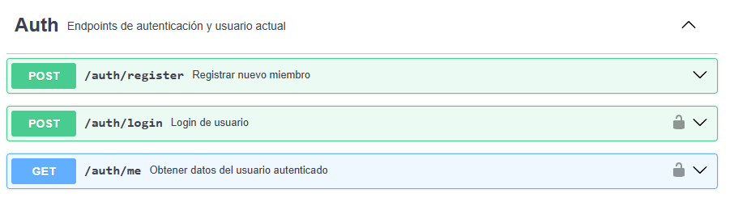

---

### 👤 Perfil de usuario (`/api/profile`)
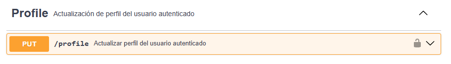

---

### 🧾 Miembros (`/api/members`)
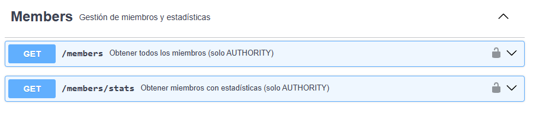

---

### 🏺 Hallazgos (`/api/finds`)
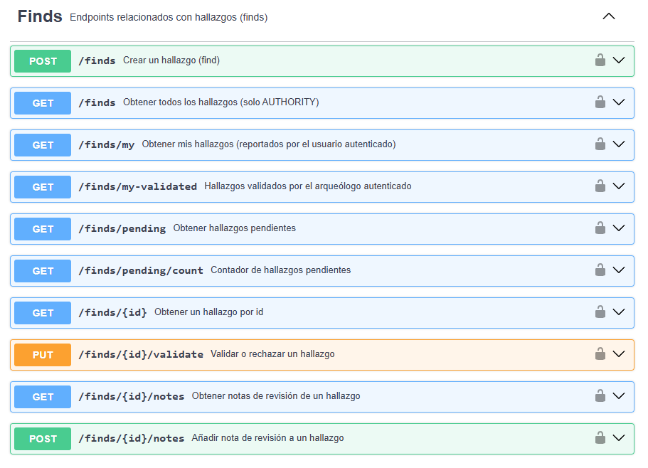

---

### 🗺️ Áreas protegidas (`/api/protected-areas`)
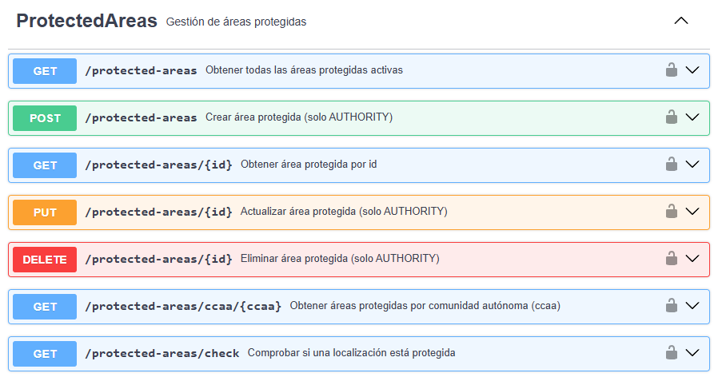

---

### 📊 Estadísticas y panel de autoridad (`/api/stats`)
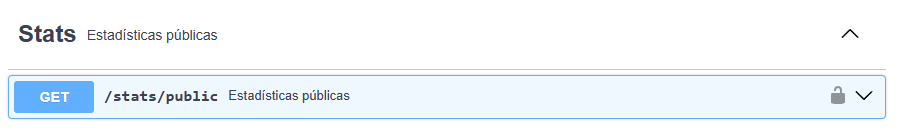


## 🖥️ Capturas de pantalla

### Autenticación
#### Login
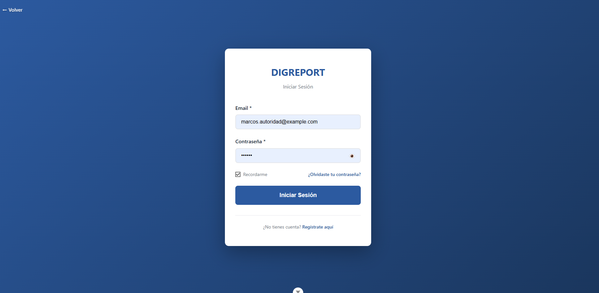

### Registro y Perfil
#### Registro
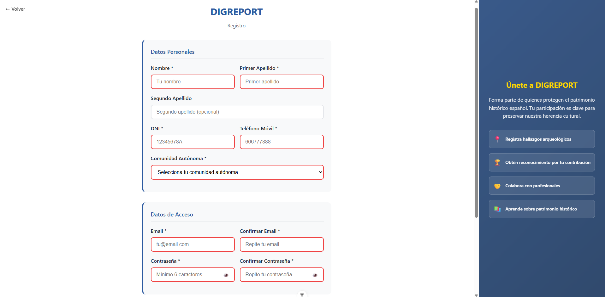

#### Editar perfil
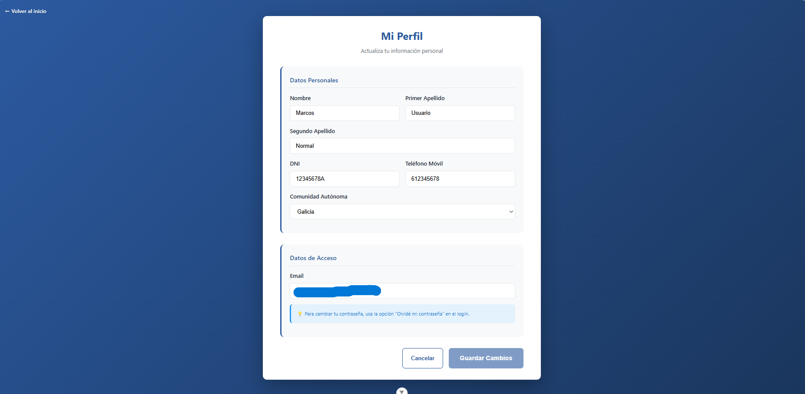

### Panel de administración (solo rol autoridad)
#### Panel de administración 1
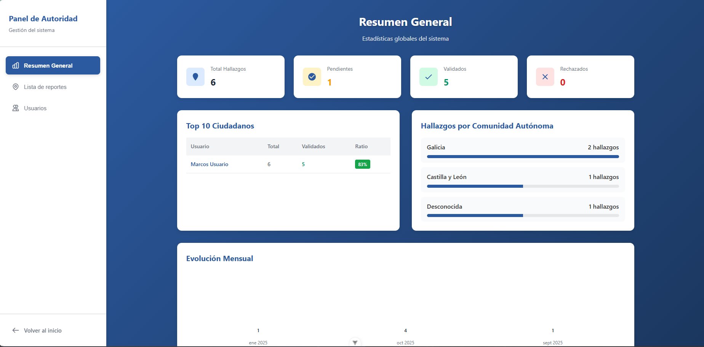

#### Panel de administración 2
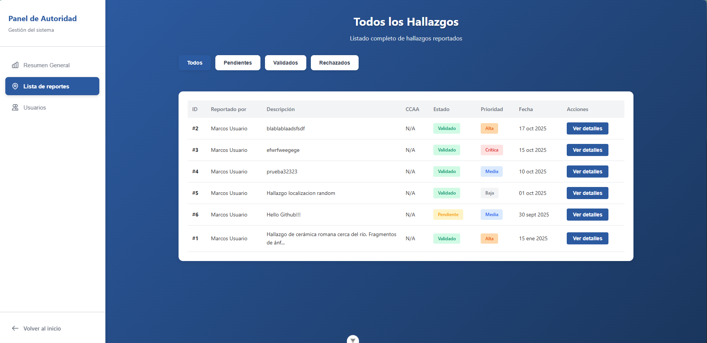

#### Panel de administración 3


#### Panel de administración 3
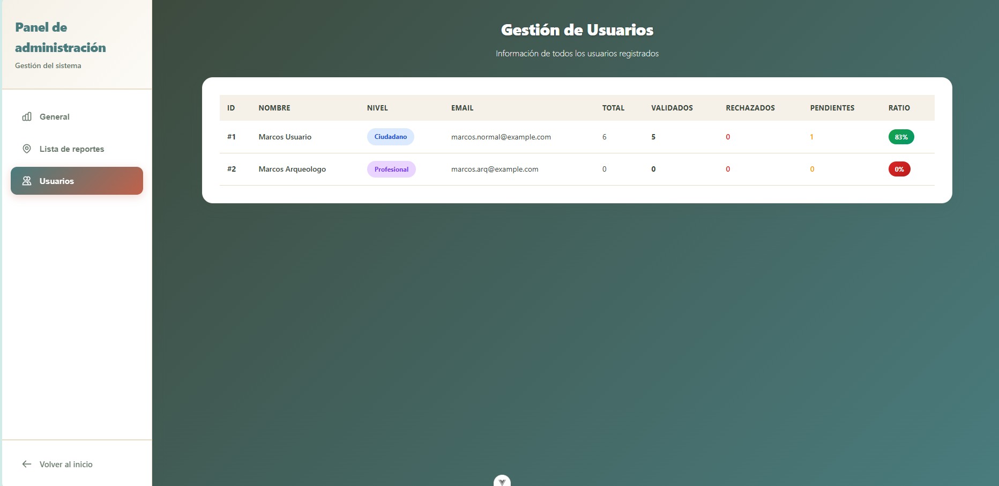

### Informes (usuarios)
#### Home
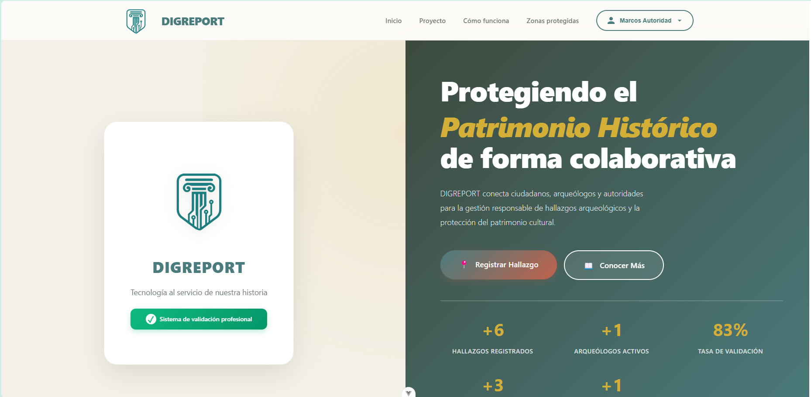

#### Formulario de informe de hallazgo
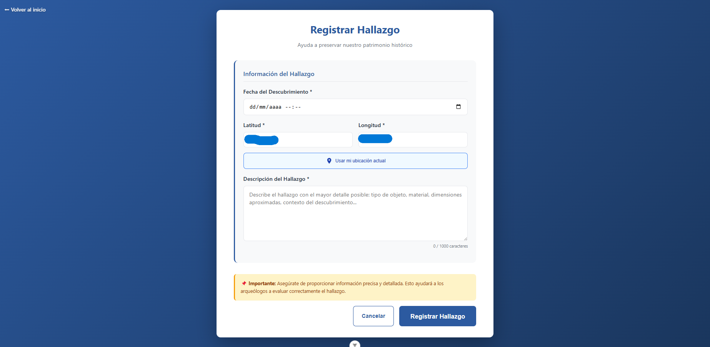

#### Mis informes
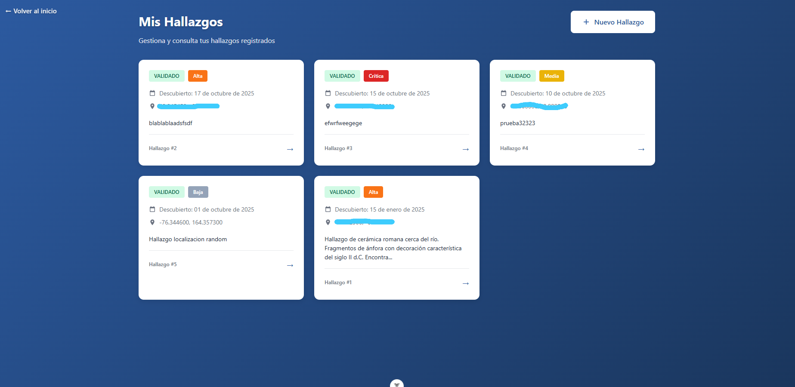

#### Detalles y validación (solo rol profesional tiene botón validar)
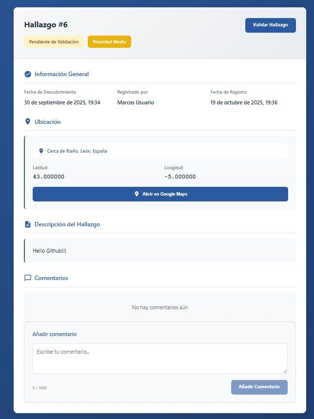

### Validaciones (solo rol profesional)
#### Mis validaciones
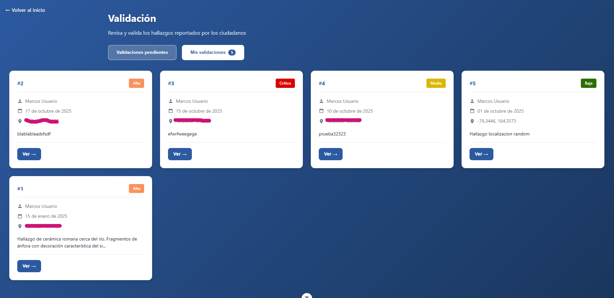

#### Validaciones pendientes
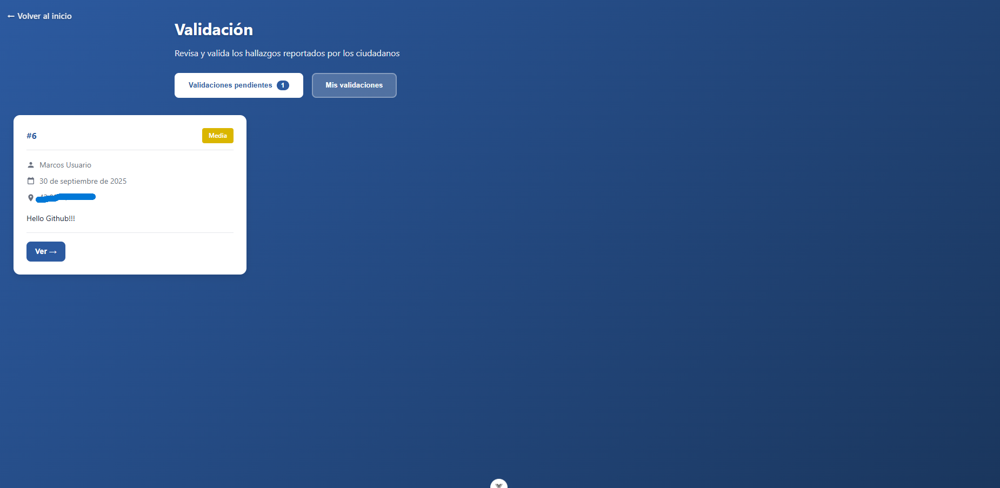

### Mapa interactivo
#### Vista del mapa
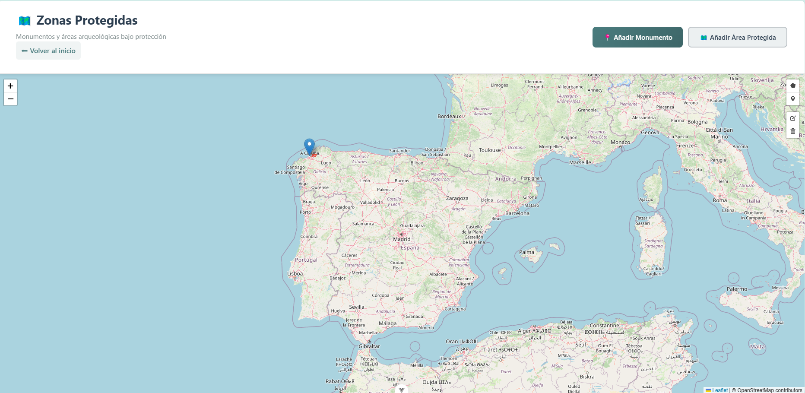

#### Formulario registro área protegida
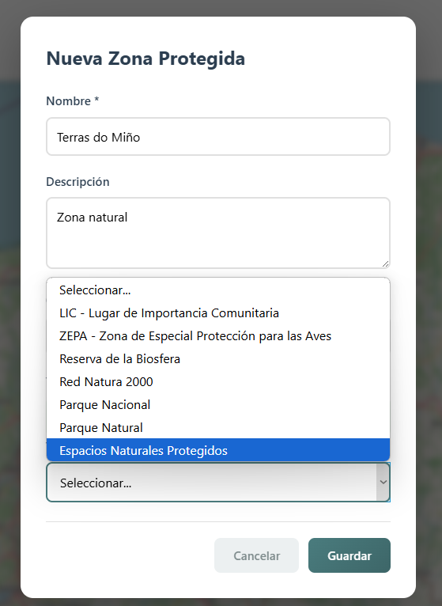

#### Formulario registro monumento o bien protegido
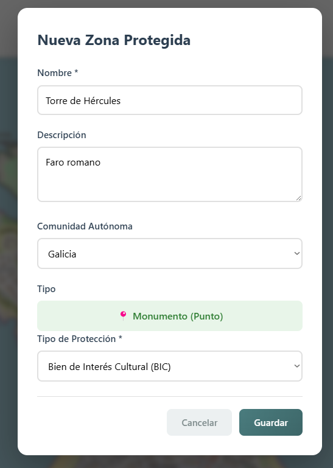

